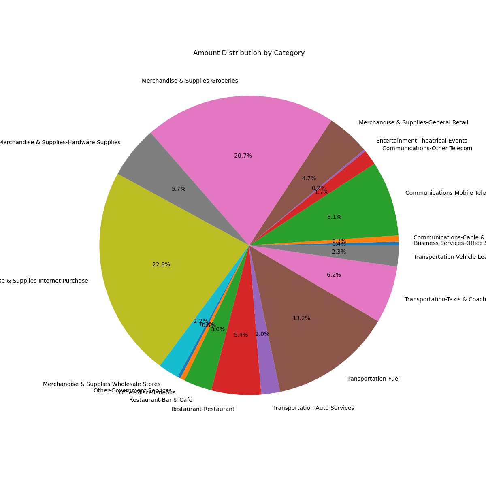

# Finance Series: Personal Finance 
## 1. Monthly Spending Reivew
## Introduction

The personal finance series represents my effort to maintain a record of my financial situation. Through the creation of tools, I aim to analyze and comprehend my expenditure patterns.

This marks the first installment of my personal finance series, in which I delve into a breakdown of my monthly spending. In my case, I rely on a single credit card for all my transactions.

I have discovered that regularly reviewing my spending habits enables me to contemplate my purchases, identifying which ones were worthwhile and which ones were not. I then apply the insights gained from this process to guide my financial decisions in the subsequent months.

In a world filled with clever marketing strategies and convenient one-click checkout experiences, it becomes a constant struggle to resist spending money on unnecessary items or fleeting indulgences.

## Step 1: Define the Problem
When it comes to data, the first step is to always define the problem. Having a clear understanding of the objective of your analysis and determining what insights you are looking for from the data will save you a lot of time. 
-> In my case, my objective is identify the purchses that I made during the statement period

## Step 2: Formatting the Data
One of the most important tasks when working with data is exploring the data to understand its structure, features and relationships. Then you need to format the data by identifying missing values and clean the data correcting errors and missing values. Prepare the data for analysis by selecting relevant variables and observations.
-> In my case, I downloaded my statement from my credit card provider and formatted the data to only include the necessary information for my analysis. This meant getting rid of the city, phone number, account number, etc. 

## Step 3: Anaylzing the Data
Applying statistical techniques to derive insights from the data. 
-> In my case, I was looking to calcuate total spend, amount spent by each card memeber, top 5 expensive purchases and amount spent in each category. 

## Step 4: Visualization
Create visual representations (plots, charts, graphs) to gain insights. 
